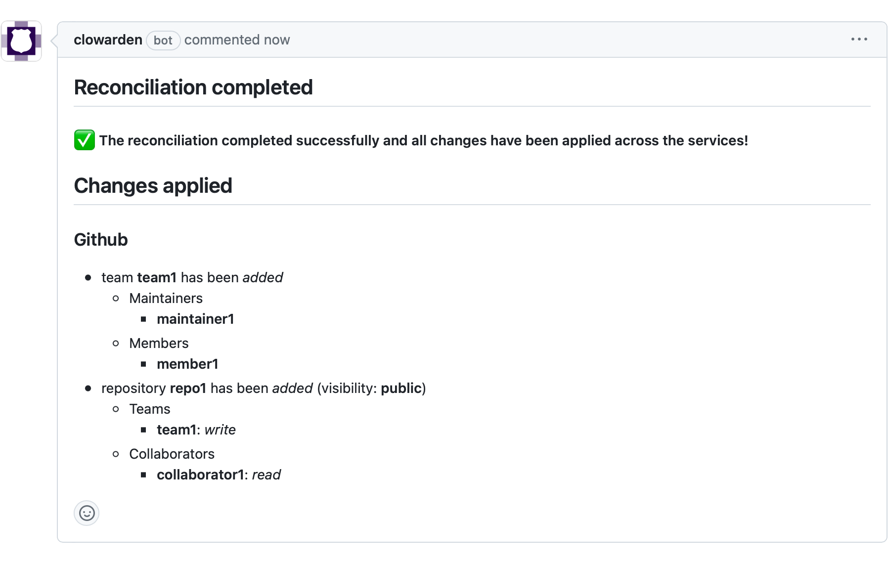
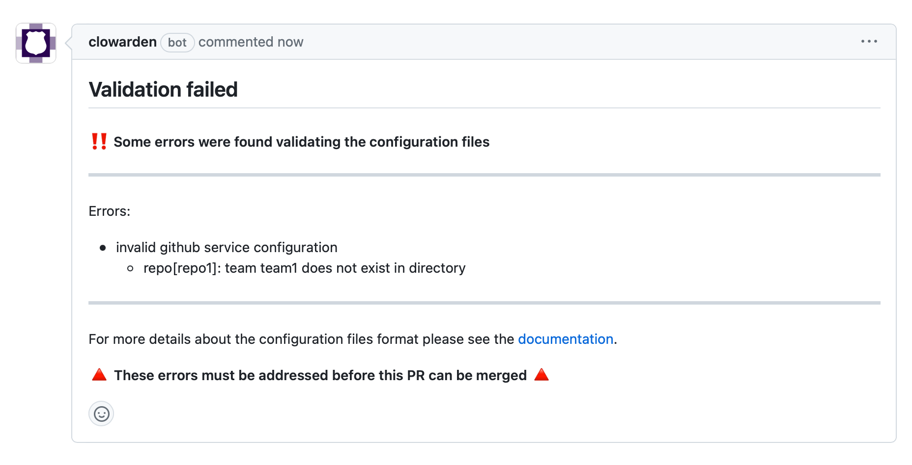
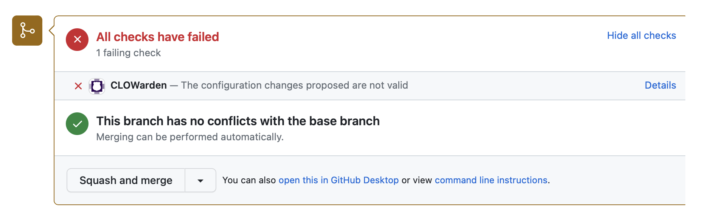
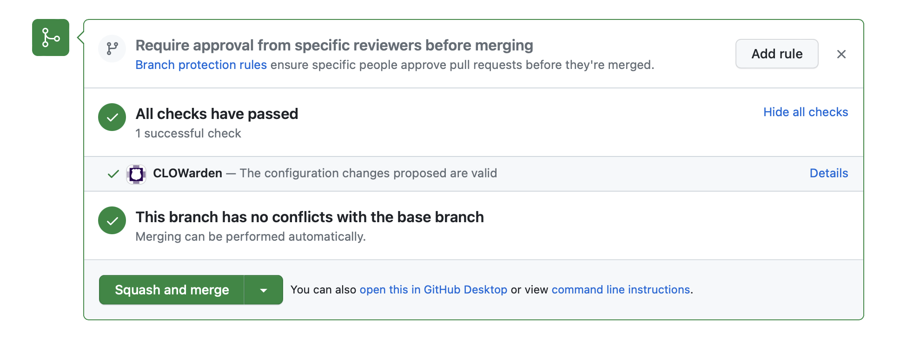

# CLOWarden

[](https://github.com/tegioz/clowarden/actions/workflows/ci.yml)

**CLOWarden** automatically manages organizations users, teams and other resources across multiple services.

The CNCF has recently begun to use [Sheriff](https://github.com/cncf/sheriff) to manage people-related resources. CLOWarden is an *experiment* to replace Sheriff with a system that suits better the needs of the CNCF. To facilitate experimentation and make a potential transition easier, CLOWarden supports a legacy configuration mode that allows using a subset of the [Sheriff's permissions configuration file](https://github.com/electron/sheriff#permissions-file) to define resources like teams and GitHub repositories (the same file currently used by CNCF at <https://github.com/cncf/people/blob/main/config.yaml>).

## How it works

CLOWarden's main goal is to ensure that the resources' **desired state**, as defined in the configuration files, matches the **actual state** in the corresponding services. This is achieved by running *reconciliation* jobs, that can be triggered *on-demand* or *periodically*. These reconciliation jobs are in charge of applying the necessary changes to address the differences between the desired and actual state on each service, which is done by delegating some work on specialized *service handlers*.

CLOWarden monitors pull requests created in the configuration repository and, when applicable, it creates a reconciliation job to apply the necessary changes. This is what we call an on-demand reconciliation job: it's created as a result of a user's action, and changes are applied immediately once the pull request is merged.



Sometimes, however, this may not be enough. Changes can be applied manually to the service bypassing the configuration files (i.e. from the GitHub settings UI), and CLOWarden still needs to make sure that the actual state matches the desired state. So in addition to on-demand reconciliation jobs, CLOWarden runs periodic ones to ensure everything is all right all the time.

### State

The core piece of state is the **directory**, which is a catalog that contains **teams** and **users**. The directory is at the disposal of all the services handlers, allowing them to take the appropriate action for each directory change detected. For example, when a new team is added to the directory, the GitHub service handler will create that team on the GitHub organization.

But teams and users may not be enough in some cases, and some service handlers may need to define additional resources. This is the case of the GitHub service handler, which defines an additional resource, the repository.

## Sample workflow

Changes to resources in services managed by CLOWarden should be proposed via *pull requests*. CLOWarden will check all pull requests created in the configuration repository defined and, when it detects that the PR contains changes to any of the configuration files, it will start working on it.

Let's go through a full example to see how this would work in practice.

Our goal in this example will be to create a new team (named *team1*) with one maintainer and one member, as well as a new repository (named *repo1*). We want to give *team1* write permissions on *repo1*, and we'd also like to add a external collaborator, named *collaborator1*, with read permissions.

The first step will be to create a pull request to add the entries below to the configuration files (*please note that we are intentionally introducing an error in this code snippet*):

```yaml
teams:
  - name: tem1
    maintainers:
      - maintainer1
    members:
      - member1

...

repositories:
  - name: repo1
    teams:
      team1: write
    external_collaborators:
      collaborator1: read
    visibility: public
```

As soon as the pull request is created, CLOWarden will detect it and will proceed to **validate** the changes proposed.

One of CLOWarden goals is to try to make it *as simple as possible for maintainers to review and approve suggested changes* to the configuration. To do that, CLOWarden provides feedback in pull requests in the form of comments. Suggested changes can be invalid for a number of reasons, like a syntax problem in the configuration file, or not following any of the rules, like using an invalid role when defining permissions. CLOWarden tries its best to give helpful feedback to the pull request creator, to point them in the right direction and help address errors without requiring the maintainers intervention.

In this case, the error we introduced intentionally was catched: we incorrectly defined the new team as *tem1*, but then used it as *team1* in the repository definition.



Please note that, in addition to the feedback comment, CLOWarden created a **check** in the PR to indicate that the configuration changes are not valid. When used in combination with branch protection, this can help prevent that invalid configuration changes are merged.



The pull request creator can now push a fix to address these issues. Once that's done, CLOWarden will validate the changes again automatically.


Now CLOWarden is happy with the changes proposed! This time, it also tries to help the maintainer who will approve the changes by describing in the comment what has changed. Sometimes this may be easy to spot by just looking at the files diff. But in other occasions, depending on the changes applied, it can get trickier and be error prone, as just a single space or tabulation difference can have unintented consequences. So CLOWarden tries to simplify this by analyzing the changes itself and displaying them in an easy to read way.



Now that the changes are valid, the check has been updated to reflect the new status and the PR can be merged once the maintainers are ready. As soon as this happens, CLOWarden will create a reconciliation job and will apply the necessary changes so that the actual state in the services matches the new desired state defined in the configuration. Once the job is executed, a new comment will be posted on the PR with more details:


In this case all changes were applied successfully, but if something would have gone wrong the comment would display the corresponding error.

## Audit tool

CLOWarden registers all changes applied to the services in a database. Even though most of the time all information related to a given change will be accessible on the PR that triggered it, sometimes it may be necessary to go a bit further to answer questions like:

- *When was user1 granted access to repository1 and who approved it?*
- *In what PR was team1 removed?*
- *What changes have been applied by automatic periodic reconciliations during the last 24 hours?*

To help to answer these questions quickly, CLOWarden provides an audit tool that allows maintainers to easily search and inspect applied changes. The audit tool can be accessed by using a web browser and is available at: `https://YOUR-CLOWARDEN-URL/audit/`.


## Services supported

The following services are supported at the moment:

### GitHub

Operations supported:

- Add teams
- Remove teams
- Add maintainers or members to teams
- Remove maintainers or members from teams
- Add repositories
- Add teams to repositories
- Remove teams from repositories
- Update teams' role in repository
- Add collaborators to repositories
- Remove collaborators from repositories
- Update collaborators' role in repository
- Update repository visibility

## Using CLOWarden in your organization

CLOWarden is still in an experimental phase and breaking changes are expected, so we do not recommend to use it in production enviroments yet. Once it stabilizes, we'll publish some additional documentation to make it easier to run your own CLOWarden instance.

## Contributing

Please see [CONTRIBUTING.md](./CONTRIBUTING.md) for more details.

## Code of Conduct

This project follows the [CNCF Code of Conduct](https://github.com/cncf/foundation/blob/master/code-of-conduct.md).

## License

CLOWarden is an Open Source project licensed under the [Apache License 2.0](https://www.apache.org/licenses/LICENSE-2.0).
